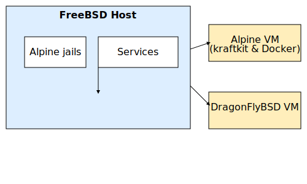

# Architecture Overview

This document illustrates how the FreeBSD host interacts with Alpine jails, a bhyve-based Alpine VM running kraftkit and Docker, and an additional DragonFlyBSD VM.

## Components

- **FreeBSD host** – base system that manages bhyve and jails.
- **Alpine jails** – lightweight containers used for small services.
- **Alpine VM (bhyve)** – runs kraftkit and Docker for heavier workloads.
- **DragonFlyBSD VM** – separate environment for testing.

Network traffic can flow between the jails, the virtual machines and the host. The diagram below shows a high-level view of these interactions.

